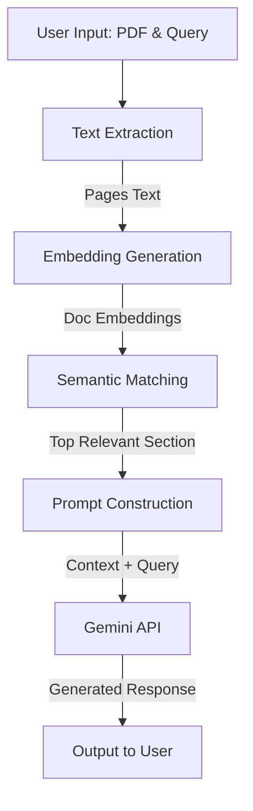

# DocChat AI

DocChat AI is an intelligent document interaction pipeline that allows users to ask questions about their PDF documents and receive accurate, context-aware answers powered by the Gemini 2.0 API.

## Features

- **Automated Text Extraction**: Efficiently extracts readable text from PDF documents using `pdfplumber`.
- **Semantic Search**: Utilizes `sentence-transformers` (all-MiniLM-L6-v2) to find the most relevant sections of the document based on the user's query.
- **LLM-Powered Explanations**: Integrates with the Gemini API to synthesize and explain the extracted context clearly and thoroughly.
- **Production-Ready**: Features robust error handling, environment variable management, object-oriented pipeline architecture, and comprehensive logging.

## Pipeline Flow



## Setup Instructions

1. **Clone the repository:**
   ```bash
   git clone https://github.com/AryanSinghGangwar/DocChat_AI.git
   cd DocChat_AI
   ```

2. **Create a virtual environment (optional but recommended):**
   ```bash
   python -m venv venv
   source venv/bin/activate  # On Windows use: venv\Scripts\activate
   ```

3. **Install dependencies:**
   ```bash
   pip install -r requirements.txt
   ```

4. **Environment Variables:**
   - Copy the `.env.example` file to `.env`:
     ```bash
     cp .env.example .env
     ```
   - Add your Gemini API Key in the `.env` file:
     ```env
     GEMINI_API_KEY=your_gemini_api_key_here
     ```

## Usage

You can run the script interactively:

```bash
python program.py
```

Or pass the arguments directly via the command line:

```bash
python program.py --pdf path/to/document.pdf --query "What is the main topic of this document?"
```

## Architecture Details

- **Extraction Layer**: Parses PDF binaries into a structured format (Page Number, Text Content).
- **Retrieval Layer**: Uses Hugging Face's `sentence-transformers` for dense vector representation and PyTorch for fast cosine similarity computation.
- **Generation Layer**: Leverages Google's Generative AI (Gemini) for reasoning over the retrieved context.
